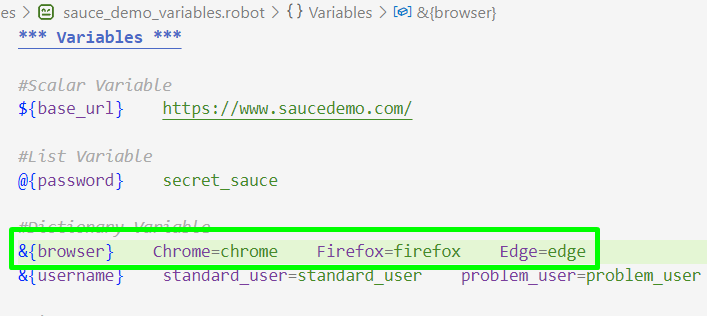
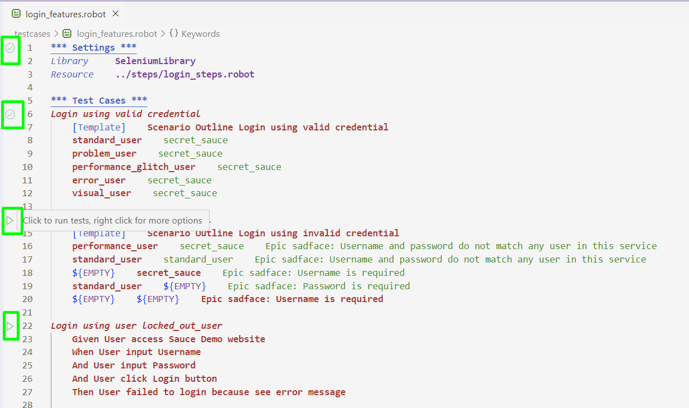
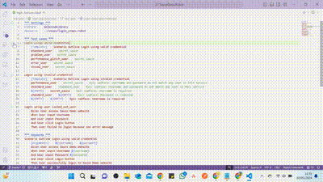
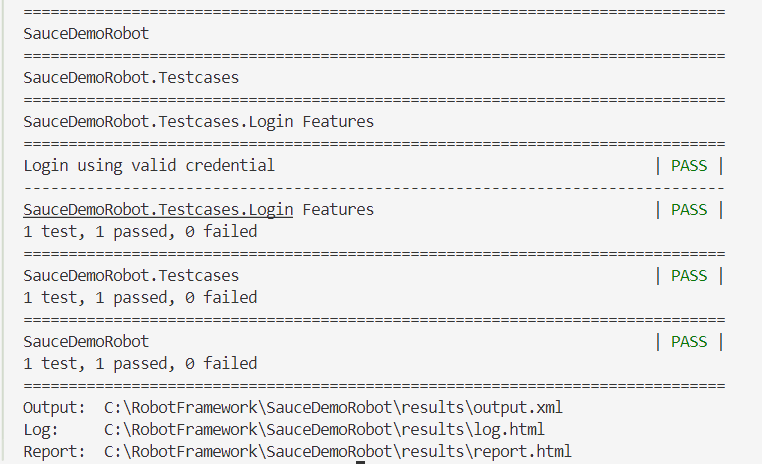
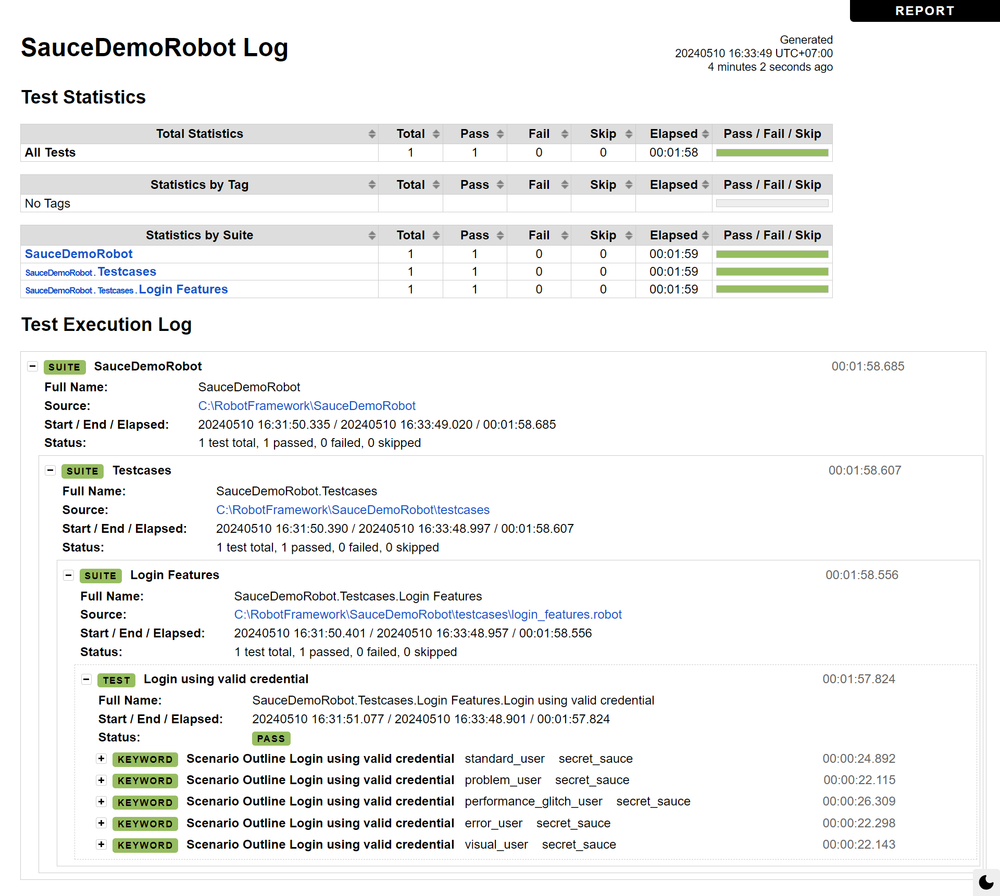

# SauceDemoRobotFramework

## :scroll:Sauce Demo website
Sauce Demo is Sauce Labs' open source websites. This website is a simple E-Commerce that can be used as an alternative website to show validation and possible errors that will occur on a website.


## 🤖Python & Robot version
- Python version: 3.12.3
- Robot version: 7.0


## 🖥️Installation
1. Install Python (https://www.python.org/downloads/)
2. Install Robot Framework
   ```
   pip install robotframework
   ```
3. Install Selenium Library
   ```
   pip install --upgrade robotframework-seleniumlibrary
   ```
4. [For VS Code User] Install RobotCode extension (https://marketplace.visualstudio.com/items?itemName=d-biehl.robotcode)


## 🏃‍♀️How to Run (VS Code)
#### 1. Set Up browser for Test Driver
#####   a. Set Up all browser that will be used in variables files


#####   b. Set Up browser that will be used when executing the test case in steps files
<vid src="screenshot/setup_browser_steps.png" width="360">

#### 2. Run Test Script
#####   a. Via VS Code Run Test Button


#####   b. Via Terminal Command
######     - Run this script to execute selected test case
   ```
   robot -t "test_cases_name" --report report --outputdir output --logtitle "Task log" features_file_location
   ```
  ######     For example:
   ```
   robot -t "Login using valid credential" --report report --outputdir output --logtitle "Task log" C:\\RobotFramework\\SauceDemoRobot\\testcases\\login_features.robot
   ```
######     - Run this script to execute all test cases
   ```
   robot .
   ```


## ✔️Test scenario Name
1. Login using valid credential
2. Login using invalid credential
3. Login using user locked_out_user
4. Purchase product as standard_user
5. Purchase product as standard_user when user didn't fill data in Your Information page


## 📹Running Result
#### Here is an example of a running video


### Report
#### Report can be accessed in the following ways:
1. If run test cases via VS Code Run Test Button or via Terminal Command using script to execute selected test case, then:

      a. Open file report.html on results folder after test running has been finished
   
      b. Open file report.html on Terminal after test running has been finished

2. If run test cases via Terminal Command using script to execute all test case, then open file report.html on your project folder after test running has been finished

#### Here is an example of Robot Framework report


